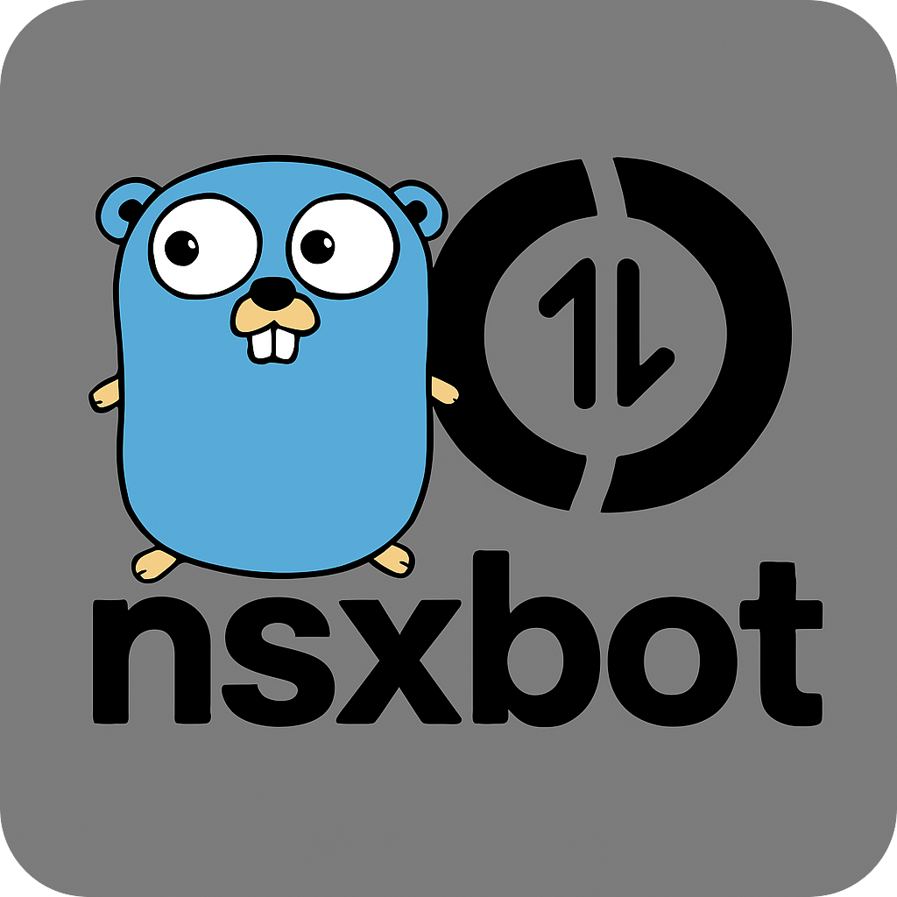

# Nsxbot Onebot Framework




[](https://qm.qq.com/cgi-bin/qm/qr?k=d5DcTIKBYVmaHZHZ4BqwKaXop4ePjrh_&jump_from=webapi&authKey=nY7Yhr6GhgbS28XBw0nrH4M3tutmPF9U1+5m7GCaRgaABTqBHkTcHC1l1Sa1NFrh)

Nsxbot 是一个使用 [Go](https://go.dev/) 语言编写，基于 [OneBot 11](https://github.com/botuniverse/onebot-11) 协议的聊天机器人框架。

提供类似Web框架风格的API，如果你是一个Go Web开发者，那么你可以非常方便的使用Nsxbot。

## 特性
- http，websocket 协议支持
- 支持多客户端统一处理
- 泛型支持，远离any
- 中间件支持
- 过滤器支持
- 事件分组监听
- 自由组合与可扩展性

## 快速开始

### 获取

```sh
go get -u github.com/atopos31/nsxbot
```
> [!IMPORTANT] 
> 未发布第一版测试，你会拉取到仓库的最新提交，不保证可靠，框架正在开发中......
### 运行
回复示例：
```go
package main

import (
	"context"
	"log/slog"

	"github.com/atopos31/nsxbot"
	"github.com/atopos31/nsxbot/driver"
	"github.com/atopos31/nsxbot/types"
)

func main() {
	ctx, cancel := context.WithCancel(context.Background())
	defer cancel()
	bot := nsxbot.Default(ctx, driver.NewDriverHttp(":8080", "http://localhost:4000"))

	pvt := nsxbot.OnEvent[types.EventPvtMsg](bot)

	pvt.Handle(func(ctx *nsxbot.Context[types.EventPvtMsg]) {
		text, err := ctx.Msg.TextFirst()
		if err != nil {
			slog.Error("Error parsing message", "error", err)
			return
		}
		slog.Info("Private Message", "message", text.Text)
		ctx.Reply(text.Text)
		var msg types.MeaasgeChain
		ctx.SendPvtMsg(ctx, 2945294768, msg.Text("收到回复了吗？").Br().Text("2333333333"))
	})

	// Run
	bot.Run(ctx)
}
```