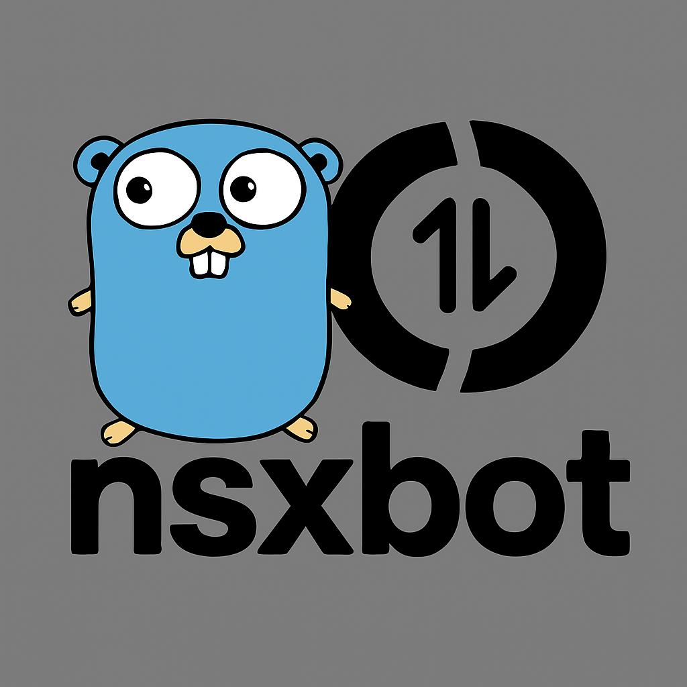

# Nsxbot Onebot Framework




Nsxbot 是一个使用 [Go](https://go.dev/) 语言编写，基于 OneBot 11 协议的聊天机器人框架。
拥有类似Web框架风格的API，如果你是一个Go Web开发者，那么你可以非常方便的使用Nsxbot。

## 特性
- http，websocket 协议支持
- 泛型支持，远离any
- 中间件支持
- 过滤器支持
- 事件分组监听
- 自由组合与可扩展性

> [!IMPORTANT]  
> 现在还无法使用，框架正在开发中。。。。。

## 快速开始

### 获取

```sh
go get -u github.com/atopos31/nsxbot
```

### 运行
回复示例：
```go

package main

import (
	"context"
	"log/slog"
	"time"

	"github.com/atopos31/nsxbot"
	"github.com/atopos31/nsxbot/driver"
	"github.com/atopos31/nsxbot/types"
)

func main() {
	emitter := driver.NewHttpEmitter("http://localhost:4000")
	listener := driver.NewHttpListener(":8080")
	httpdriver := driver.NewHttpDriver(listener, emitter)
    
	bot := nsxbot.Default(httpdriver)

	pvt := nsxbot.OnEvent[types.EventPvtMsg](bot)

	pvt.Handle(func(ctx *nsxbot.Context[types.EventPvtMsg]) {
		text, err := ctx.Msg.TextFirst()
		if err != nil {
			slog.Error("Error parsing message", "error", err)
			return
		}
		slog.Info("Private Message", "message", text.Text)
		ctx.Reply(text.Text)
	})

	ctx, cancel := context.WithCancel(context.Background())
	defer cancel()

	bot.Run(ctx)
}
```